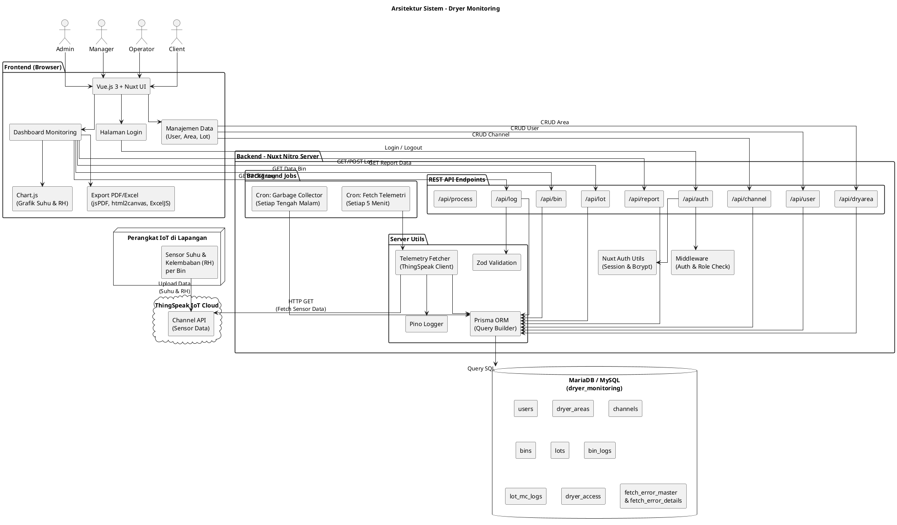

# System Architecture Diagram - Dryer Monitoring

Berikut adalah kode PlantUML untuk diagram arsitektur sistem aplikasi *Dryer Monitoring*.

## Penjelasan Arsitektur

### 1. Frontend (Browser)
Pengguna mengakses sistem melalui browser. Antarmuka dibangun menggunakan **Vue.js 3** dengan komponen **Nuxt UI**. Data sensor divisualisasikan menggunakan **Chart.js**, dan laporan bisa diekspor ke **PDF** (jsPDF) atau **Excel** (ExcelJS).

### 2. Backend (Nuxt Nitro Server)
Server berjalan di atas **Nitro** (engine bawaan Nuxt). Terdiri dari:
- **REST API Endpoints**: Menyediakan layanan data untuk auth, user, area, channel, bin, lot, log, dan report.
- **Middleware**: Mengecek sesi login dan hak akses (role) sebelum setiap request diproses.
- **Server Utils**: Berisi Prisma ORM (koneksi ke database), Pino (logging), Zod (validasi input), dan modul Telemetry (pengambilan data dari ThingSpeak).
- **Background Jobs (Cron)**: Secara otomatis mengambil data sensor dari ThingSpeak setiap 5 menit, serta membersihkan data sementara (ephemeral) setiap tengah malam.

### 3. Database (MariaDB/MySQL)
Seluruh data disimpan di database relasional **MariaDB**. Tabel utama meliputi: `users`, `dryer_areas`, `channels`, `bins`, `lots`, `bin_logs`, `lot_mc_logs`, `dryer_access`, dan `fetch_error_master/details`.

### 4. ThingSpeak IoT Cloud
**ThingSpeak** adalah layanan cloud IoT yang menerima data dari sensor di lapangan. Server backend secara berkala menarik (fetch) data terbaru dari ThingSpeak melalui API-nya.

### 5. Perangkat IoT (Sensor)
Sensor suhu dan kelembaban (RH) yang terpasang pada setiap **Bin** dryer di lapangan mengirimkan data secara periodik ke ThingSpeak Cloud.
