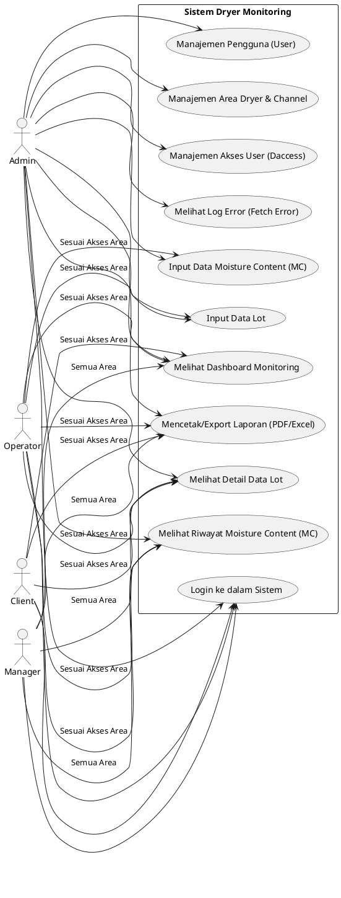

# Usecase Diagram: Role Admin, Manager, Operator, dan Client

Berikut adalah kode PlantUML untuk diagram *Use Case* yang mencakup 4 role: **Admin** (pengelola penuh), **Manager** (pemantau semua area), **Operator** (penginput data di lapangan), dan **Client** (pemantau area tertentu).

## Penjelasan Singkat
1.  **Client**: Hanya bisa *login* dan **memantau** (melihat dashboard, data lot, dan riwayat MC), serta mengekspor laporan. Aksesnya **dibatasi hanya pada area dryer tertentu**.
2.  **Operator**: Bertugas di lapangan. Mereka memiliki akses seperti Client, namun ditambah dengan kemampuan untuk **menginput data** (seperti membuat Data Lot baru atau *update* Moisture Content/MC) pada area yang ditugaskan kepada mereka.
3.  **Manager**: Berperan sebagai pemantau (*View Only*). Manager tidak menginput data, namun mereka bisa melihat seluruh dashboard, riwayat data lot/MC, dan mencetak laporan dari **semua area dryer** tanpa terkecuali.
4.  **Admin**: Memiliki hak akses penuh (*Super User*). Selain bisa menginput dan melihat seluruh data, Admin bisa mengelola akun pengguna, mengatur area & mesin, mengatur hak akses area untuk tiap *user*, dan memantau log sistem.
