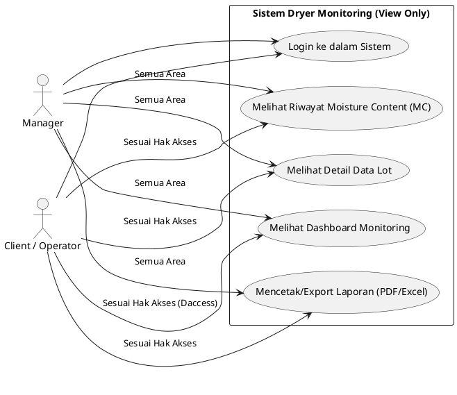

# Usecase Diagram: Role Manager dan Client (View Only)

Berikut adalah kode PlantUML untuk diagram *Use Case* di mana **Manager** dan **Client** hanya bertindak sebagai pemantau (*View Only*) di dalam sistem *Dryer Monitoring*.

## Penjelasan Singkat
Pada skenario **View Only** ini, tidak ada aktivitas penambahan, pengubahan, atau penghapusan data yang dilakukan oleh Manager maupun Client:
1.  **Client**: Hanya bisa login dan memantau (melihat *dashboard*, data lot, dan riwayat kadar air/MC), serta mengekspor laporan **khusus untuk area dryer** yang memang diberikan akses kepadanya.
2.  **Manager**: Memiliki fungsi yang sama persis (hanya melihat dan mencetak laporan), namun Manager memiliki hak akses *read-only* secara **global** untuk memantau seluruh area *dryer* yang ada di dalam sistem tanpa terkecuali.
